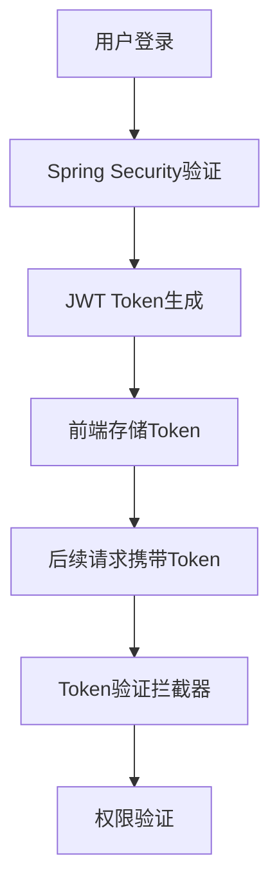
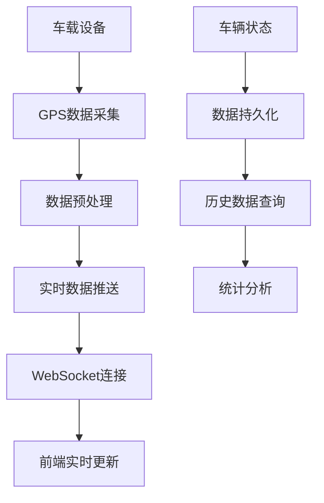
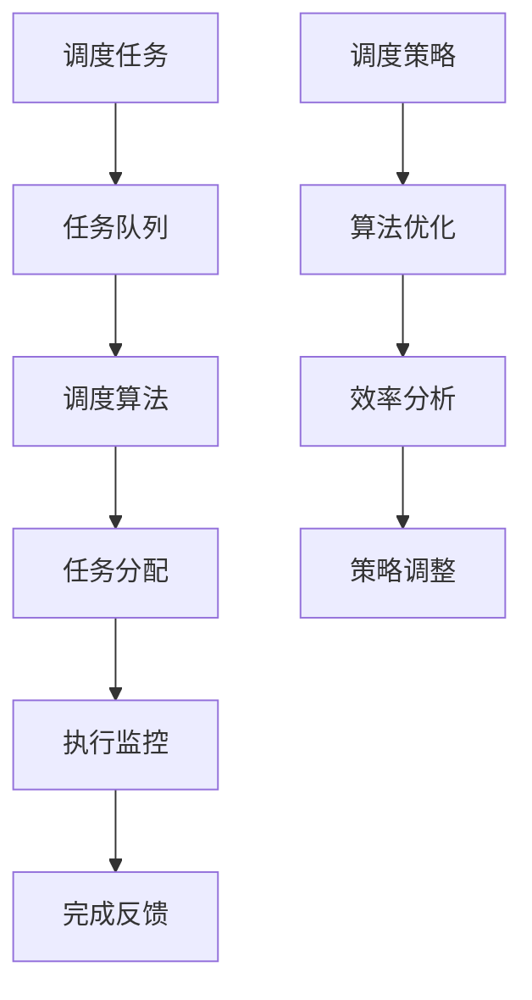

# 机场车辆监控与调度系统架构设计

## 系统架构概述

### 1. 整体架构

采用经典的B/S架构模式，前后端分离设计：

```
┌─────────────────┐    ┌─────────────────┐    ┌─────────────────┐
│   前端Vue.js    │    │  SpringBoot后端 │    │    MySQL数据库  │
│                 │    │                 │    │                 │
│  ┌─────────────┐│    │  ┌─────────────┐│    │  ┌─────────────┐│
│  │ 用户界面    ││◄──►│  │ REST API    ││◄──►│  │ 主数据库     ││
│  │ Dashboard   ││    │  │ Controller  ││    │  │             ││
│  └─────────────┘│    │  └─────────────┘│    │  └─────────────┘│
│                 │    │                 │    │                 │
│  ┌─────────────┐│    │  ┌─────────────┐│    │  ┌─────────────┐│
│  │ 实时监控    ││    │  │ 业务逻辑    ││    │  │ 缓存数据库   ││
│  │ 图表展示    ││    │  │ Service     ││    │  │ Redis       ││
│  └─────────────┘│    │  └─────────────┘│    │  └─────────────┘│
└─────────────────┘    └─────────────────┘    └─────────────────┘
```

### 2. 技术架构层次

#### 前端层 (Vue.js 3)
- **框架**: Vue.js 3 + Composition API
- **UI组件**: Element Plus
- **状态管理**: Pinia
- **路由**: Vue Router 4
- **HTTP客户端**: Axios
- **图表库**: ECharts

#### 后端层 (SpringBoot 3.2)
- **Web框架**: Spring Boot 3.2
- **数据访问**: Spring Data JPA
- **安全框架**: Spring Security
- **缓存**: Spring Cache + Redis (已实现，使用Spring Data Redis)
  - Redis为可选组件，未运行时自动降级到内存缓存
  - 支持无密码和有密码两种配置方式
- **实时通信**: WebSocket (已实现)
  - 原生WebSocket实现，支持JWT认证
  - 前端连接：`/ws/vehicles`
  - 传感器连接：`/ws/sensor`
- **API文档**: Swagger/OpenAPI 3
- **验证**: Spring Validation

#### 数据层 (MySQL + Redis)
- **主数据库**: MySQL 8.0
- **缓存**: Redis (可选，用于缓存车辆位置、用户会话等)
  - 使用Spring Data Redis + Lettuce连接池
  - 支持连接池配置和超时设置
- **ORM**: Hibernate
- **连接池**: HikariCP (数据库) + Lettuce (Redis)

## 模块设计

### 1. 用户认证模块 (Authentication Module)



**功能特性:**
- JWT Token认证
- 密码加密存储
- 权限控制
- 会话管理

### 2. 车辆监控模块 (Vehicle Monitoring Module)



**功能特性:**
- 实时位置跟踪（WebSocket推送）
- 状态监控
- 轨迹回放
- 异常报警
- 传感器数据接收（预留接口）

**技术实现:**
- WebSocket实时通信：
  - `/ws/vehicles` (前端连接，需要JWT token认证)
  - `/ws/sensor` (传感器设备连接，需要deviceId参数)
- Redis缓存车辆位置数据（可选，未运行时降级到内存缓存）
- JWT认证保护WebSocket连接
- 支持订阅/取消订阅特定车辆位置更新
- 心跳检测保持连接稳定
- 自动重连机制

### 3. 调度管理模块 (Dispatch Management Module)



**功能特性:**
- 智能调度算法
- 任务优先级管理
- 负载均衡
- 效率优化

### 4. 车辆管理模块 (Vehicle Management Module)

**实体关系:**
```
用户 (User) ────┐
                ├── 车辆 (Vehicle) ─── 车辆类型 (VehicleType)
                │                      │
调度任务 (Task) ─┘                      ├── 维修记录 (Maintenance)
                                        └── 运行记录 (Operation)
```

### 5. 统计分析模块 (Analytics Module)

**功能模块:**
- 实时数据统计
- 历史趋势分析
- 效率评估报告
- 预测分析

## 数据流设计

### 1. 实时数据流

```
车载设备 → API网关 → 数据验证 → 消息队列 → 数据处理 → 数据库存储 → 缓存更新 → 前端推送
```

### 2. 用户操作流

```
用户操作 → 前端验证 → API调用 → 业务逻辑处理 → 数据操作 → 响应返回 → 状态更新
```

## 安全架构

### 1. 认证与授权

- **认证方式**: JWT Token
- **授权机制**: 基于角色的访问控制(RBAC)
- **密码策略**: BCrypt加密
- **会话管理**: Token过期控制

### 2. 数据安全

- **数据传输**: HTTPS加密
- **敏感数据**: 数据库字段加密
- **SQL注入防护**: 参数化查询
- **XSS防护**: 输入验证和编码

### 3. 系统安全

- **API限流**: 防止恶意请求
- **CORS配置**: 跨域访问控制
- **安全头**: HTTP安全头配置
- **审计日志**: 操作记录追踪

## 性能优化

### 1. 数据库优化

- **索引优化**: 关键字段建立索引
- **查询优化**: 避免N+1查询问题
- **分页查询**: 大数据量分页处理
- **读写分离**: 主从数据库配置

### 2. 缓存策略

- **Redis缓存**: 热点数据缓存
- **本地缓存**: 频繁访问数据
- **缓存更新**: 数据一致性保证

### 3. 前端优化

- **懒加载**: 组件按需加载
- **虚拟滚动**: 大数据列表优化
- **CDN加速**: 静态资源加速
- **代码分割**: JavaScript代码分割

## 部署架构

### 1. 开发环境

```
开发机器: SpringBoot (8080) + MySQL (3306) + Redis (6379)
```

### 2. 生产环境

```
负载均衡器 ──► 应用服务器集群
                    │
                   ├─► 数据库服务器 (主从)
                   ├─► Redis集群
                   └─► 文件存储
```

### 3. 容器化部署

```yaml
# Docker Compose配置
version: '3.8'
services:
  backend:
    build: ./backend
    ports:
      - "8080:8080"
    environment:
      - SPRING_PROFILES_ACTIVE=prod
  
  frontend:
    build: ./frontend
    ports:
      - "80:80"
  
  mysql:
    image: mysql:8.0
    environment:
      MYSQL_ROOT_PASSWORD: password
  
  redis:
    image: redis:alpine
```

## 监控与运维

### 1. 应用监控

- **健康检查**: Spring Boot Actuator
- **性能指标**: Micrometer + Prometheus
- **日志管理**: ELK Stack
- **链路追踪**: Spring Cloud Sleuth

### 2. 告警机制

- **异常监控**: 自动异常告警
- **性能告警**: 阈值告警
- **业务告警**: 自定义业务规则
- **通知方式**: 邮件、短信、钉钉

## 技术选型理由

### 1. SpringBoot优势

- 快速开发，约定优于配置
- 内置服务器，简化部署
- 丰富生态，整合能力强
- 生产就绪 Actuator监控

### 2. Vue.js优势

- 学习曲线平缓
- 组件化开发
- 响应式数据绑定
- 丰富的UI组件库

### 3. MySQL优势

- 成熟稳定的关系数据库
- 性能优秀，扩展性好
- 丰富的数据类型支持
- 强大的事务处理能力

## 扩展性设计

### 1. 水平扩展

- 无状态服务设计
- 负载均衡配置
- 数据库分库分表
- 缓存集群部署

### 2. 功能扩展

- 微服务架构迁移
- 新功能模块插件化
- 第三方系统集成
- 移动端支持

## 总结

本架构设计充分考虑了机场车辆监控系统的业务特点和技术要求，采用成熟稳定的技术栈，确保系统的可靠性、可扩展性和可维护性。通过前后端分离的设计，提高了开发效率，同时便于后续的功能扩展和技术升级。